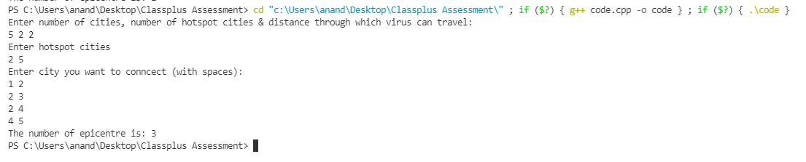
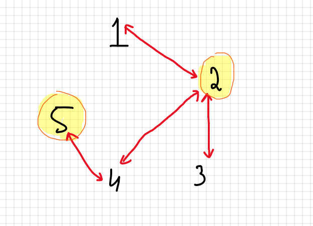

# Solution for Backend Assignment 2

## **How to run the code**:

### Take input:

S. No. | Comment | Example
--- | --- | ---
1 | Value of n, h, x (space separated) where,  <UL> <LI> n=No. of cities <LI>h=No. of epicentre <LI> x=Distance through which virus can travel </UL>| 5 2 2
2 | Hotspots cities | 2 5
3 | Now connect cities | 1 2   2 3   2 4   4 5 

***
*Here the image as an example:*

---
## **Approach**:
Here in this question, I need to make connections between the cities along calculating the length of paths between cities for finding the epicentre. **Graph** will be the most suitable data-structure for this case.  
Further, we can use graph traversal algorithms like DFS/BFS for travering through the graph.

Eg. 
Taking the case given in the question:

5 2 2 ----->n, h, x  
2 5   ------->hotspots  
1 2   ------->connected cities  
2 3       
2 4   
4 5   

*This is the graph and the highlighted nodes are the hotspots.*

where,
- n-No. of cities
- h-No. of epicentre
- x-Distance through which virus can travel

### Now we need to identify the epicentre:  

For this I am finding all the nodes/cities through which virus can be transmitted. 
- Given hotspots are : 2 and 5
- From node 2 others nodes can be infected are->2, 1, 3, 4, 5  
- From node 5 others nodes can be infected are->5, 4, 2  

**Here, we can conclude that 5, 4, 2 are the common nodes from both the cities. Therefore, the total epicentre are 3.**

    

    

